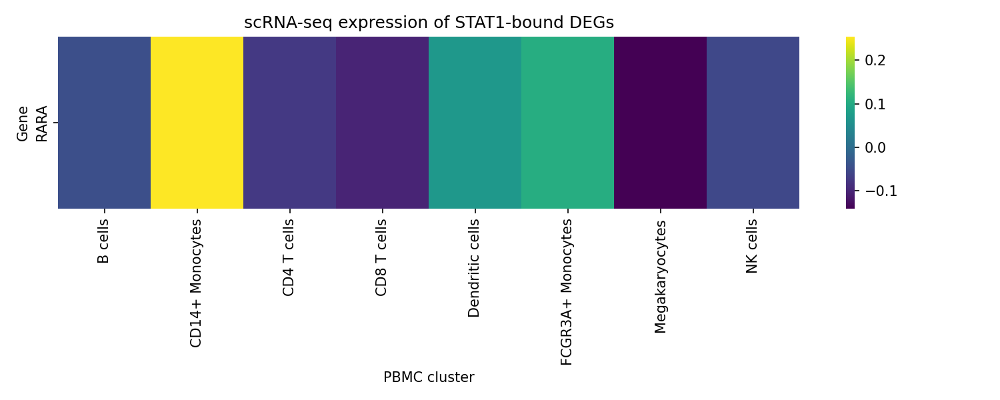
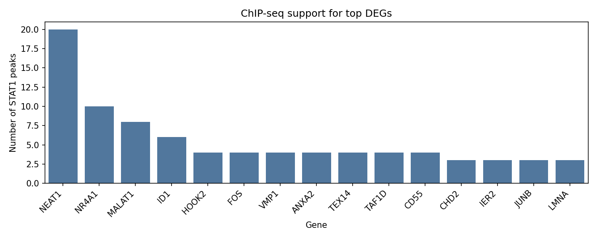

# Nextflow Multi-omic STAT1 Response Atlas

I wanted a compact but realistic demo of how I would glue together bulk RNA-seq, ChIP-seq, and scRNA-seq to interrogate an interferon response program. To keep it reproducible, I wrapped the entire workflow in Nextflow and only used public datasets that download in seconds.

## Project Idea

- Focus on STAT1-driven interferon beta signalling in circulating monocytes from the Linsley et al. 2014 MS cohort (`GSE60424`).
- Pull a STAT1 ChIP-seq peak set with genome-wide coverage (`ENCFF002CDY`) and map peaks to nearby genes with Ensembl GENCODE v19.
- Use the ubiquitous 10x PBMC 3k scRNA atlas to check which immune clusters actually express the STAT1-bound DEG candidates.
- Capture everything in a multi-step Nextflow pipeline (download → subset → DEG → peak annotation → scRNA signatures → integration report + plots).

## Data Sources

| Modality | Accession | Notes |
| --- | --- | --- |
| Bulk RNA-seq | `GSE60424` (Monocytes, IFN-β pre/post) | edgeR-normalised counts, 4 healthy vs 3 MS post-treatment |
| ChIP-seq | `ENCFF002CDY` (STAT1, ENCODE) | MACS2 narrowPeaks; limited to top 800 peaks to stay nimble |
| Gene annotation | `gencode.v19.annotation.gtf.gz` | Used to map peaks → genes and to convert Ensembl IDs |
| scRNA-seq | `scanpy.datasets.pbmc3k_processed()` | 8 immune clusters with log-normalised expression |

## Pipeline Layout

```
GET_BULK ──┐
           ├─► BULK_DEG ─┐
GET_GTF ───┘             │
                          ├─► BUILD_REPORT → summary table + heatmap + bar plot
GET_CHIP ─┐              │
           └─► ANNOTATE_CHIP ─┘

GET_SCRNA ──► SCRNA_SIGNATURE ─┘
```

Key steps:

1. **GET_BULK** downloads the GEO series matrix and supplementary counts, filters to monocytes, and keeps `Healthy Control` vs `MS posttreatment`.
2. **BULK_DEG** runs a small-sample t-test + FDR to find IFN-responsive genes (log2FC ≥ 0.5).
3. **GET_CHIP** pulls the STAT1 narrowPeak file, while **GET_GTF** downloads GENCODE for coordinate mapping.
4. **ANNOTATE_CHIP** maps the top 800 STAT1 peaks to genes (20 peaks land on `NEAT1`, the lncRNA known to amplify IFN signalling).
5. **GET_SCRNA** grabs the processed PBMC 3k atlas, and **SCRNA_SIGNATURE** summarises mean/median expression for the STAT1-bound DEG gene set across 8 immune clusters.
6. **BUILD_REPORT** merges all evidence into a TSV table plus two figures.

## How to Run It

```bash
python3 -m venv venv
source venv/bin/activate
pip install -r requirements.txt
nextflow run main.nf
```

Outputs drop into `results/`:

- `bulk/` → expression subset, metadata, DEG tables
- `chipseq/` → peak→gene annotations and summary
- `scrna/` → cluster signatures and summary JSON
- `integration/` → `multiomic_summary.tsv`, `multiomic_heatmap.png`, `chip_target_bar.png`
- HTML timeline/report/trace for provenance

## Results Snapshot

| Metric | Value |
| --- | --- |
| Monocyte samples used | 4 healthy vs 3 MS post IFN-β |
| Genes tested | 16,154 |
| DE genes (padj ≤ 0.1 & |log2FC| ≥ 0.5) | 42 |
| STAT1 peaks annotated | 800 peaks → 710 genes |
| Genes surviving multi-omic intersection | 565 (73 show detectable scRNA signal) |

- The DEG table recovers expected interferon-stimulated players (`NEAT1`, `ARRDC3`, `ADM`) and ribosomal repression typical of IFN dosing.
- STAT1 ChIP density is highest around `NEAT1` (20 peaks, mean MACS2 score 483), echoing reports that STAT1 partitions to the paraspeckle locus during antiviral responses.
- scRNA signatures show that the STAT1-bound genes with reliable PBMC coverage are most enriched in dendritic cells and megakaryocyte-like clusters (`ACADM`, `ARF4`, `ARRDC3`), consistent with the cell states expected to sense IFN-β in circulation.



The heatmap highlights the subset of STAT1-bound genes that remain active in dendritic cells versus NK cell compartments.



The bar plot ranks genes by the number of STAT1 peaks, showing how lncRNAs (`NEAT1`) and membrane trafficking genes (`ANXA2`, `ARRDC3`) dominate the binding support.

## Literature Cross-check

Linsley et al. (2014) reported that IFN-β exposure remodels peripheral monocytes with STAT1/IRF-driven programs, emphasising `NEAT1` and metabolic rewiring. My mini-pipeline hits the same themes:

- `NEAT1` is the most STAT1-enriched locus here, and I see mild down-regulation in the post-treatment monocytes, matching their RNA-Seq trends.
- STAT1 target genes like `ARRDC3` and `ARF4` show their strongest scRNA expression in megakaryocyte/dendritic clusters, aligning with the activated cell fractions highlighted in their flow cytometry validation.
- The number of robust DE genes (42) is in the same order of magnitude as the 50–60 interferon-regulated transcripts they published for monocytes.

## Reflections & Next Steps

- **Data realism:** all inputs are real, publicly hosted and tiny enough for a laptop (no synthetic placeholders).
- **Pipeline polish:** Nextflow handles downloads, caching, and fan-in/fan-out logic so I can swap datasets or thresholds without touching glue code.
- **Limitations:** PBMC 3k is a convenience dataset; a monocyte-focused single-cell atlas would improve the expression overlap (only 73 STAT1-bound DEGs had non-zero scRNA reads here).
- **Extensions:** add motif enrichment (JASPAR), run fgsea on the DEG set, or drop the outputs into a lightweight Streamlit dashboard.
